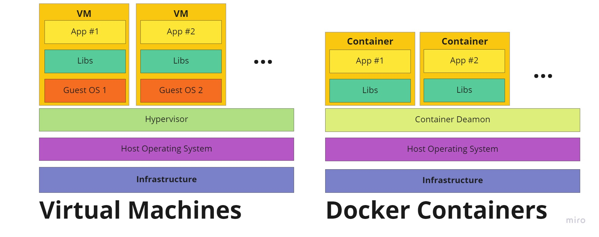

# What is Docker?
Docker is important for developers because it allows them to build and run their applications on a virtualized environment. This means that the applications are not tied to a specific machine and can be run on any machine that has the docker engine installed. While VM engines also allows us to do the same, docker accomplishes this in more efficient ways. 

You can imagine docker as a lightweight VM. Every docker container has its own process space, own network interface, you can get a shell on it, install packages and run stuff as root or regular user. VM creates virtual hardware layer, and then we can run additional OS on that software. Docker uses host kernel for executing processes, no virtual hardware is used. Because of that, Docker can run only OS that is compatible with a host kernel. If you want to run different OS than HOST, then Docker needs to use VM behind the scenes. There is exception for running Linux containers on Windows, Docker can be set up to use WSL (Windows Subsystem for Linux). The big win for Docker is that it runs applications directly on hardware by isolating the process on the host machine.

Containers are not very new, they exist in the linux kernel since 2008 (LXC), and in some OSes even before. The problem with containers those days was that containers were not easy to use. You need to install a lot of software to use them, and you need to know a lot about kernel in order to be able to set up a kernel for a new virtual environment. And the most important, it was hard to share and move them between machines.

Docker simplified process of creating containers and running them. But, this is not the main feature why people started using Docker. People started using Docker because it introduced concept of images. Image format is what god everyone's attention. Repeatability, ability to scale and streamline are very big wins.

From the image above, we can see that containers are more lightweight than virtual machines. They require less memory, containers start faster, consume less CPU, and they are more portable. Those properties make them ideal for using in cloud environments.

# How To Get Started With The Docker
The best place to start with Docker is to go to the [official website](https://www.docker.com/) and download the latest version. Official website is also a good place to find more information about Docker. It contains video and text tutorials. 

Important to note that Docker is not only container engine. There is alternative tool called Podman, it has almost identical commands as Docker and you can check it out [here](https://podman.io/).

# Docker basic building blocks
## What is docker image?
### What is docker image layer?
Copy-on-write mechanism.

Should we have copy for each container? It would take a lot of resources in terms of storage. Docker layers helps us solve this problem by utilizing principle of copy on write.

image::image-2022-03-23-18-58-36-458.png[layers on scale]

General principle is not to replicate all the layers again. Rather, the idea is to extend all of those layers. Blocks on the right side represent current running containers. Each block represents running container file. Those files includes/represents any file differences from the original application/layers.

image::image-2022-03-23-18-57-37-685.png[copy on write]

Layers can be shared between multiple containers (shared libraries). This means that we can scale up very easily.
# What is docker container?
* I can get a shell on it through SSH or otherwise
* Build, ship, and run software in any location that has Docker.
Each process is living in its own little world.

image::image-2022-03-23-11-18-37-322.png[arhitecture]

image::image-2022-03-23-19-19-19-677.png[containersvsvm]
image::image-2022-03-23-19-20-23-342.png[whenweHaveVM]

### What are Docker Container, Image and Layer?

### What are layers?
Docker can be useful tool for us to deploy and develop applications. It allows us to create consistent environments in terms of software packages and dependencies and version controls of software. It allows all developers to work from the same versions and the same software, share environments. We can build our deployment environment. Simple as moving image to server and running container to a server.

### What are images?
Images are collection of file-system layers and metadata. Fancy way of saying collection of files. When we run all layers together, they are run as Container.
image::image-2022-03-23-18-48-34-197.png[docker image]

### What is container?
Container is a running instance of a image. We can have multiple containers running of a same image. By running container, we don't affect or change image.

## How developers use docker?

image::image-2022-03-23-19-15-52-639.png[workflow]
image::image-2022-03-23-19-16-49-606.png[workflow more complete]

## Docker uses client server architecture

Docker receive commands as rest api requests.

image::image-2022-03-23-19-21-22-923.png[clientServer]

curl --no-buffer -XGET --unix-socket /var/run/docker.soc http://docker/container/stress/stats

/var/run/docker.soc (docker network file)

We get streaming output.

docker system events --since 20220223
same
curl --no-buffer -XGET --unix-socket /var/run/docker.soc http://docker/container/events

## Docker commands
komanda koja lista kontejnere (sta se trenutno vrti u dockeru)
[source, shell]
----
docker container ls (moze i docker ps)
docker container ls -a i ono sto je nekada radilo
----

docker info informacije o samom hostu gde se trenutno vrti docker

run container and exec command in docker
[source, shell]
----
docker run ubuntu /bin/cat /etc/issue.net
----

exec command interactive
[source, shell]
docker run -t -i ubuntu /bin/bash

run container in background
[source, shell]
docker run -d ubuntu /bin/sh -c "while true; do date; echo hello world; sleep 1; done"

lista procesa
[source, shell]
docker ps

specify ports
[source, shell]
----
docker run -p 4000:80 friendlyhello

docker run -d -p 4000:80 friendlyhello (background)

docker login

docker tag image username/repository:tag

docker tag friendlyhello gordon/get-started:part2

docker push username/repository:tag
----

## Execute command into running docker
docker container exec -ti quantum /bin/sh

top shows host process id real process id
inside container ps auxww shows isolated process id

## Logs in Docker
We log to standard out and standard err
On the host you can make decision where to send those logs

docker container logs --help

docker container logs -f quantum

-f je follow
docker container logs -t quantum

-t adds docker time

## Clean up
Clean up docker "<none>" images:
works in bash only

docker rmi $(docker images -f "dangling=true" -q)

Clean up all stopped containers

docker container rm $(docker container ls -aq)

### Dockerfile UID

Set a default non-root UID in your Dockerfiles.

user <UID>{:GUID>]
or
user user:group
e.g. user myuser:mygroup

We cannot set time on the system by default!
When we run with --privileged=true we can set time on docker host and every container working on it.

There is danger in running in privilaged, especially in long running containers.

FIX add priviledge only to thing that needs privileges.
not run container in --privileged mode.

--cap-add=SYS_TIME
add special capability - much fine-grained.

remove capability
--cap-drop=NET_RAW

## Docker beyond the basics

docker container run -ti --privileged --pid=host debian nsenter -t 1 -m -u -n -i sh
--pid=host = share pid namespace with host (process will see all processes from the host).

look at the system as underlying host
same thing ass ssh into server

git clone https://github.com/spkane/docker201.git

## Automating workflow
* Datastore
    - Postgres
* Collaborative Source Code Repository
    - Gogs
* Docker Image Repository
    - Docker Distribution
* Build, Test, and Deploy
    - Jenkins

### Iterative Workflow
* Core Technology - Docker
  User develops code locally (Docker)
  User commits code (Gogs backend by Postgres)
  Pipeline builds & tests code (Jenkins & Docker Distribution)
  Pipeline deploys code to production.
  and then iterate...

### Composing a Docker Service
Typically, used by developers docker-compose.

### Iterative Workflow

- User develops code locally (Docker)
- User commits code (Googs backed by Postgres)
- Pipeline builds & tests code (Jenkins & Docker Distribution)
- Pipeline deploys code to produciton.
- and then iterate...

### Docker compose
docker-compose.yaml

Is a tool that allows you to speen up in repeatable way. It allows developers, to speen up multiple containers.

It is yaml file. Markup language, designed to be human readable, hierarchical.

read yaml and will create docker commands
networks:
my-net:
driver: bridge
we are creating little network and we are putting all containers into it.

services: main - most important
postgres:
container_name: class_postgres_4
image: postgres:11.1
restart: unless-stopped
networks:
- my-net
ports:
- 16432:5432"
environment:
POSTGRES_USER...

For error:
rr:1 http://archive.ubuntu.com/ubuntu focal InRelease At least one invalid signature was encountered.

https://stackoverflow.com/questions/59139453/repository-is-not-signed-in-docker-build
fixed by:
docker image prune -f
docker container prune -f
docker volume prune -f
docker system prune (cleans up build cache)

https://docs.docker.com/config/pruning/

### Memory cgroup: accounting
We can count how much memory is used by each process or group of processes. We can keep track of every sigle memory page used by a group of processes. Granularity is a memory page. 4kb on most arhitectures. File pages are pages are ones that you can track down to one specific location on disk. If there is something on disk that corresponds to that page then it is counted as a disk page. This is important because at some point if OS is in a rush and needs memory quick, it can remove that page, because it is also stored on disk. OS don't need to swap it out.

Anonymous memory does not correspond to something on disk (malloc). In order to reclaim that memory, OS needs to swap it out on the disk.

Kernel puts those 2 things in 2 pools: Active and inactive memory.
At the beginning, everything is active, when we fill memory, then kernel starts to move stuff in inactive. Each time, you touch page, it goes to active. Each page belongs to a group. When multiple groups are using page. There is only group that pays for the page.

Each group can have it's own individual limits. Limits are optional. There is 2 kinds of limits Soft and Hard. Soft limits are not strictly enforced.
If you go above hard limit, the process get's killed. This is on the cgroup level. Kernel kills one random process. If one specific process goes out of memory, instead of randomly killing a process somewhere else. Kernel will kill the process in that container. Which we say, put one service in a container, don't put multiple services in one container. In that way, you can have good granularity and innocen process will not be killed, because some other process went out of memory.

You can go above soft limit just fine. So, what is the point of soft limit. When the memory preassure starts to be really strong (machine will soon get out of memory). Then will look at cgroups/processes, that are above soft limit. The more process is above soft limit, the more likely it's memory will be paged into the disk.

* Keeps track of pages used by each group:
- file (read/write/mmap from block devices)
- anonymous (stack, heap, anonymous mmap)
- active (recently accessed)
- inactive (candidate for eviction)
* Each page is "charged" to a group
* Pages can be shared across multiple groups
- e.g. multiple processes reading from the same files when pages are shared, only one group "pays" for a page

### Memory cgroup: avoiding OOM killer

* Do you like when the kernel terminates random processes because something unrelated ate all the memory in the system?

* Setup oom-notifier

* Then, when the hard limit is exceeded:
- freeze all processes in the group
- notify user space (instead of going rampage)
- we can kill processes, raise limits, migrate containers ...
- when we're in the clear again, unfreeze the group

### Memory cgroup: tricky details

* Each time the kernel gives a page to a process, or takes it away, it updates the counters
* This adds some overhead
* This cannot be enabled/disabled per process
- it has to be done at boot time
* When multiple groups use the same page, only the first one is "charged"
- but if it stops using it, the charge is moved to another group

### HugeTLB cgroup
* Controls the amount of huge pages usable by a process
- Safe to ignore if you don't know what huge pages are

### CPU cgroup
It let's us track CPU usage on the granularity of a whole cgroup.

* Keeps track of user/system CPU time
* Keeps track of usage per CPU
* Allows to set weights
* Can't set CPU limits - doesn't make sense.
- OK, let's say you give N%, then the CPU throttles to a lower clock speed, now what? Same if you give a time slot instructions? their exec speed varies wildly. Doesn't make sence.

### Cpuset cgroup

* Pin groups to specific CPU(s)
* Reserve CPUs for specific apps
* Avoid processes bouncing between CPUs
* Also relevant for NUMA systems
* Provides extra dials and knobs
- per zone memory pressure, process migration costs...

### Blkio cgroup

Lets you measure and limit the amount block IO done by cgroups and containers.

* Keeps track of I/Os for each group
- per block device
- read vs write
- sync vs async
* Set throttle (limits) for each group
- per block device
- read vs vrite
- ops vs bytes
* Set relative weights for each group
* Note: most writes go through the page cache
- so classic writes will appear to be unthrottled at first

### Net_cls and net_prio cgroup

* Automatically set traffic class or prioprity, for traffic generated by processes in the group
* Only works for egress traffic
* Net_cls will assign traffic to a class
- class then has to be matched with tc/iptables, otherwise traffic just flows normally
* Net_prio will assign traffic to a priority
- priorities are used by queuing disciplines

