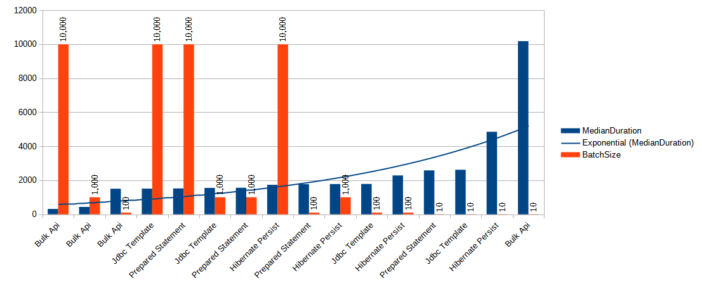

## Introduction
In the previous post [Fastest way to insert the data in MS SQL - Part 1 Hibernate Batching](../persist_vs_saveall/) 
we compared the performance of Hibernate inserts with batching turned off vs batching turned on.
In this post, we will explore other ways to insert data into MS SQL server and compare performance with Hibernate.

We will consider four different ways to persist data:
1. Using Hibernate batching, calling persist method.
2. Manually inserting data using a prepared statement with batching.
3. Using Spring Data Jdbc Template with batching.
4. Using Microsoft Bulk API.


### Hibernate Batching
Hibernate batching is implemented as following:
```java
@Override
public <T> void persistAndFlushInChunks(List<T> objects, int bulkInsertBatchSize) {
	if(CollectionUtils.isEmpty(objects)){
		return;
	}

	// set manual flush mode
	entityManager.setFlushMode(FlushModeType.COMMIT);
	entityManager
			.unwrap(Session.class)
			.setJdbcBatchSize(bulkInsertBatchSize);

	for(List<T> chunk : Lists.partition(objects, bulkInsertBatchSize)) {
		persistAndFlushObjects(chunk);
	}
}

private <T> void persistAndFlushObjects(Iterable<T> objects) {
	for (T object : objects) {
		entityManager.persist(object);
	}
	entityManager.flush();
	entityManager.clear();
}
```
This post details the identical implementation as the previous one. 
I enabled manual flush mode to gain enhanced control over when data gets transmitted to the MS SQL server. 
Following each flush, I clear the entity manager, as the objects have already been persisted in the database 
and are no longer needed in memory.

### Manually Inserting Data With Prepared Statement

Since all actions are performed manually, a substantial amount of code has been written to facilitate this process. 
Therefore, I will simply outline the key components and provide an explanation of how each element operates.

```java
public <T> void insert(List<? extends T> objects, TableDescriptor<T> descriptor, int batchSize) {
    Session session = entityManager.unwrap(Session.class);

    session.doWork(connection ->
            insertInternal(objects, descriptor, connection, batchSize));
}

private <T> void insertInternal(List<? extends T> objects,
                                TableDescriptor<T> descriptor,
                                Connection connection,
                                int batchSize) throws SQLException {

    try (PreparedStatement preparedStatement = prepareInsertStatement(descriptor, connection, 1)) {

        for (int i = 0; i < objects.size(); i++) {
            @NonNull List<ColumnDescriptor<T>> columns = descriptor.getColumns();
            for (int j = 0; j < columns.size(); j++) {
                ColumnDescriptor<T> columnDescriptor = columns.get(j);
                preparedStatement.setObject(j + 1, columnDescriptor.getObjectFieldValue(objects.get(i)));
            }
            preparedStatement.addBatch();
            if ((i + 1) % batchSize == 0) {
                preparedStatement.executeBatch();
                preparedStatement.clearBatch();
            }
        }
        preparedStatement.executeBatch();
        preparedStatement.clearBatch();
    }
}
```
The method takes three parameters: a list of `Person` objects to insert, 
a `TableDescriptor` providing information about the database table, and a batch size. 
Table descriptor contains column names and a mapping function for data that is used for preparing statement: `columnDescritor.getObjectFieldValue(object)`.

This method utilizes Hibernate to obtain a database session and connection. 
The actual insertion process is carried out by the `insertInternal` method, which prepares a `PreparedStatement` for inserting data. 
It iterates through the list of objects, sets their values in the prepared statement, and adds them to a batch. 
When the specified batch size is reached, the batch is executed, and this process is repeated until all objects 
are inserted.


### Using Spring Data Jdbc Template With Batching
```java
public <T> void insertBulk(TableDescriptor<T> tableDescriptor,
                           List<? extends T> data,
                           int batchSize) {
    if (data.isEmpty()) return;
    String insertQuery = getInsertQuery(tableDescriptor, 1);
    jdbcTemplate.batchUpdate(insertQuery,
            data,
            batchSize,
            (ps, argument) -> {
                List<ColumnDescriptor<T>> columns = tableDescriptor.getColumns();
                for (int i = 0; i < columns.size(); i++) {
                    ColumnDescriptor<T> columnDescriptor = columns.get(i);
                    ps.setObject(i + 1, columnDescriptor.getObjectFieldValue(argument));
                }
            });
}
```
This method represents the most straightforward approach I've employed for batch data persistence. 
It leverages the Spring data `JdbcTemplate` class, which offers a user-friendly interface and abstracts
away the intricacies of batching within the method. 
I supplied the query, data, and batchSize as parameters, with the only manual task being the population
of a prepared statement with the data.

### Microsoft Bulk Api

```java
public <T> void performBulkInsert(List<? extends T> data,
                              TableDescriptor<T> descriptor,
                              int batchSize) {
    Session unwrap = entityManager.unwrap(Session.class);

    unwrap.doWork((connection) -> {
        try (SQLServerBulkCopy bulkCopy =
                     new SQLServerBulkCopy(connection.unwrap(SQLServerConnection.class))) {
            SQLServerBulkCopyOptions options = new SQLServerBulkCopyOptions();
            options.setBatchSize(batchSize);
            bulkCopy.setBulkCopyOptions(options);
            bulkCopy.setDestinationTableName(descriptor.getTableName());

            CachedRowSet dataToInsert = createCachedRowSet(data, descriptor);
            // Perform bulk insert
            bulkCopy.writeToServer(dataToInsert);
        }
    });
}

private <T> CachedRowSet createCachedRowSet(List<? extends T> data, TableDescriptor<T> descriptor) throws SQLException {
    RowSetFactory factory = RowSetProvider.newFactory();
    CachedRowSet rowSet = factory.createCachedRowSet();

    rowSet.setMetaData(createMetadata(descriptor));

    for (T rowData : data) {
        rowSet.moveToInsertRow();
        for (int i = 0; i < descriptor.getColumns().size(); i++) {
            ColumnDescriptor<T> column = descriptor.getColumns().get(i);
            rowSet.updateObject(i + 1, column.getObjectFieldValue(rowData), column.getSqlType());
        }
        rowSet.insertRow();
    }

    rowSet.moveToCurrentRow();
    return rowSet;
}

private static  <T> RowSetMetaData createMetadata(TableDescriptor<T> descriptor) throws SQLException {
    RowSetMetaData metadata = new RowSetMetaDataImpl();

    // Set the number of columns
    metadata.setColumnCount(descriptor.getColumns().size());
    for (int i = 0; i < descriptor.getColumns().size(); i++) {
        metadata.setColumnName(i + 1, descriptor.getColumns().get(i).getColumnName());
        metadata.setColumnType(i + 1, descriptor.getColumns().get(i).getSqlType());
    }
    return metadata;
}
```
This data insertion method operates in much the same way as the preceding ones. 
The primary distinction lies in its utilization of the MS SQL server bulk API. 
This API is typically employed for importing data from a file into a table. 
However, in this instance, the source is a collection held in memory, rather than a file.

## Results
I conduct the tests using varying batch sizes for each method,
specifically batch sizes of 10, 100, and 1,000. 100,000 `Person`
objects are persisted to the database.

In each test scenario, I run the test 10 times and compute the median value
from the results. Following the completion of each test,
I truncate the `Person` table. My measurements exclusively focus on the time
taken for the insert operations to conclude.


| Method Name        | Median Duration | Batch Size |
|--------------------|-----------------|------------|
| Bulk Api           | 314             | 10000      |
| Bulk Api           | 432             | 1000       |
| Bulk Api           | 1504            | 100        |
| Jdbc Template      | 1508.5          | 10000      |
| Prepared Statement | 1520            | 10000      |
| Jdbc Template      | 1551.5          | 1000       |
| Prepared Statement | 1559.5          | 1000       |
| Hibernate Persist  | 1732            | 10000      |
| Prepared Statement | 1770.5          | 100        |
| Hibernate Persist  | 1778            | 1000       |
| Jdbc Template      | 1783            | 100        |
| Hibernate Persist  | 2281            | 100        |
| Prepared Statement | 2583            | 10         |
| Jdbc Template      | 2618.5          | 10         |
| Hibernate Persist  | 4850.5          | 10         |
| Bulk Api           | 10178.5         | 10         |



## Conclusion

Right from the start, it's apparent that the Bulk API is both the speediest and, paradoxically, 
the slowest data insertion method. 
When dealing with small batch sizes, its performance can be agonizingly sluggish. 
However, as we scale up the batch size, it truly shines and demonstrates itself as the optimal and
swiftest means of inserting data into the MS SQL server database.

The Jdbc Template and Prepared Statement methods exhibit nearly identical performance levels, 
which isn't surprising since they essentially share the same underlying code.

Furthermore, we can deduce that Hibernate Persist is the least efficient method for data persistence across
various batch sizes (excluding a batch size of 10). 
While the difference in speed is relatively minor for larger batch sizes, 
it introduces approximately a 10% increase in processing time for batch sizes of 10,000 and 1,000. 
Moreover, this overhead becomes more pronounced when dealing with smaller batch sizes.

We can employ an additional technique when working with a prepared statement. 
In our previous tests, we conducted inserts using the following statement: 
```tsql
insert into Person(person_id, user_name, first_name, last_name, years) values (?,?,?,?,?)
``` 
With this statement, we insert one person object at a time. However, MS SQL Server supports an alternative syntax: 
```tsql
insert into Person(person_id, user_name, first_name, last_name, years) values (?,?,?,?,?),(?,?,?,?,?)...
```
Allowing us to insert multiple sets of values in a single statement, up to a limit of 2,100 parameters. 
In my upcoming post, I will assess the performance of this method and compare it to the fastest Bulk API insert 
to determine its efficiency.

For updates, you can follow me on [Twitter](https://twitter.com/mare_milenkovic) or [LinkedIn](https://www.linkedin.com/in/mare-milenkovic/). 

Thank you for your attention.
