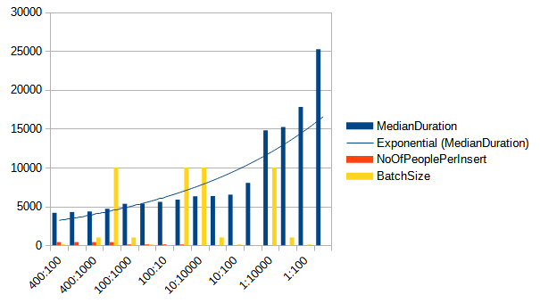

In a previous post, we concluded that the Bulk API insert is the fastest way
to insert data into an MS SQL Server database if the batch size is reasonably
large. For Jdbc Template inserts, we created a regular insert statement in the
form of `insert into table (c1, c2, c3) values (v1, v2, v3)`, where `c1, c2`,
and `c3` are column names, and `v1, v2`, and `v3` are values.

For `100,000` Person objects with a batch size in the range of
`1,000-10,000`, we concluded that Bulk API insert is **four to five times** faster
than JDBC Template. However, with MS SQL Server, JDBC Template has one more
potential speedup that it can utilize, possibly competing with Bulk API and
proving useful in certain situations.

If we check the [MS SQL Server official syntax for the insert statement](https://learn.microsoft.com/en-us/sql/t-sql/statements/insert-transact-sql?view=sql-server-ver16), 
we can see that it supports multiple values inserts in one statement. 
This means that if we want to insert multiple values into the same table, instead
of sending multiple insert statements, we can do that in a single insert statement.
The insert statement will take the following form: `insert into table (c1, c2, c3) values (v1, v2, v3), (v4, v5, v6)...`. 
The maximum number of value bindings that can be included in one statement is `2,100`, 
consistent with any other MS SQL Server statement.

## How multiple values insert impact performance
Firstly, we will compare this multiple value insert with a single value insert
and check if increasing the number of value bindings per insert statement improves
performance.

The following code is used to perform the insertion of `1,000,000` persons.
It is very similar to the code from **Part 2** except that it now generates
multi-value insert statements.

```java
public void insertPeople(TableDescriptor<Person> tableDescriptor,
                         List<Person> people,
                         int batchSize,
                         int objectsPerInsert) {
    if (people.isEmpty()) return;
    objectsPerInsert = Math.min(objectsPerInsert, people.size());

    List<List<Person>> partitions = Lists.partition(people, objectsPerInsert);
    if (partitions.size() == 1 || partitions.get(partitions.size() - 1).size() == objectsPerInsert) {
        persist(tableDescriptor, batchSize, objectsPerInsert, partitions);
    } else {
        List<List<Person>> equalSizePartitions = partitions.subList(0, partitions.size() - 1);
        persist(tableDescriptor, batchSize, objectsPerInsert, equalSizePartitions);
        List<List<Person>> lastPartition = Collections.singletonList(partitions.get(partitions.size() - 1));
        persist(tableDescriptor, 1, lastPartition.size(), lastPartition);
    }
}

private void persist(TableDescriptor<Person> tableDescriptor, int batchSize, int objectsPerInsert, List<List<Person>> partitions) {
    String insertQuery = getInsertQuery(tableDescriptor, objectsPerInsert);
    jdbcTemplate.batchUpdate(insertQuery,
            partitions,
            batchSize,
            (ps, argument) -> BulkPersistCustomRepositoryImpl.insertBatchData(tableDescriptor, ps, argument));
}

public <T> void insertBulk(TableDescriptor<T> tableDescriptor,
                           List<? extends T> data,
                           int batchSize) {
    if (data.isEmpty()) return;
    String insertQuery = getInsertQuery(tableDescriptor, 1);
    jdbcTemplate.batchUpdate(insertQuery,
            data,
            batchSize,
            (ps, argument) -> {
                List<ColumnDescriptor<T>> columns = tableDescriptor.getColumns();
                for (int i = 0; i < columns.size(); i++) {
                    ColumnDescriptor<T> columnDescriptor = columns.get(i);
                    ps.setObject(i + 1, columnDescriptor.getObjectFieldValue(argument));
                }
            });
}
```

I ran multiple tests with different batch sizes and the number of people
per insert. Each person has five fields, so the number of binding values per
insert is actually the number of people per insert times five.

The results:

| Number of people per insert | Batch size | Median duration (ms) |
|-----------------------------|------------|----------------------|
| 400                         | 100        | 4175                 |
| 400                         | 10         | 4275                 |
| 400                         | 1000       | 4348                 |
| 400                         | 10000      | 4697                 |
| 100                         | 1000       | 5335                 |
| 100                         | 100        | 5359                 |
| 100                         | 10         | 5585                 |
| 100                         | 10000      | 5873                 |
| 10                          | 10000      | 6302.5               |
| 10                          | 1000       | 6331                 |
| 10                          | 100        | 6512                 |
| 10                          | 10         | 8027.5               |
| 1                           | 10000      | 14792.5              |
| 1                           | 1000       | 15222                |
| 1                           | 100        | 17812.5              |
| 1                           | 10         | 25252                |



As we can observe, the number of bound values per insert has a significant
impact on performance. It has an even greater performance impact than the batch
size, which is, for me at least, very surprising. The more parameters we bind,
the better the performance we achieve. Interestingly, the best performance is
with a batch size of 100.

## Multi-value insert vs Bulk API

After concluding that we have much better performance with multi-value inserts,
I will now compare Bulk API inserts with JDBC Template 400-person inserts per statement.

| Method name   | Batch size | Median duration (ms) |
|---------------|------------|----------------------|
| Bulk Api      | 10000      | 3188.5               |
| Jdbc Template | 100        | 4175                 |
| Jdbc Template | 10         | 4275                 |
| Jdbc Template | 1000       | 4348                 |
| Bulk Api      | 1000       | 4358                 |
| Jdbc Template | 10000      | 4697                 |
| Bulk Api      | 100        | 14440.5              |
| Bulk Api      | 10         | 101251.5             |


Based on the results, we can see that the performance difference is much smaller
than before. As the batch size increases, Bulk API performance improves.
However, when we increase the batch size for JDBC Template to more than 100,
the performance worsens. Therefore, we should be careful when setting the batch
size for JDBC Template with multi-value inserts.

[//]: # (## Microsoft SQL `useBulkCopyForBatchInsert` parameter)

[//]: # (Per [Microsoft SQL server documentation]&#40;https://learn.microsoft.com/en-us/sql/connect/jdbc/use-bulk-copy-api-batch-insert-operation?view=sql-server-ver16&#41;)

[//]: # (there is additional parameter that can be included and that promises significant performance improvements for insert statements.)

[//]: # (Althrough, it has a lot of conditions that has to be meet to make it work for insert statement. I would be careful )

[//]: # (about decision about turning on this parameter on produciton. Eatherway, let's test the performance and compare the results.)


## Conclusion

Based on the results above, we can conclude that multi-value inserts drastically improve insert performances and that
you should definitely consider it if you have performance problems. On the other hand, if you need to insert a huge 
amount of data, then Bulk API insert is the king. 

For updates, you can follow me on [Twitter](https://twitter.com/mare_milenkovic) or [LinkedIn](https://www.linkedin.com/in/mare-milenkovic/).

Thank you for your attention.


