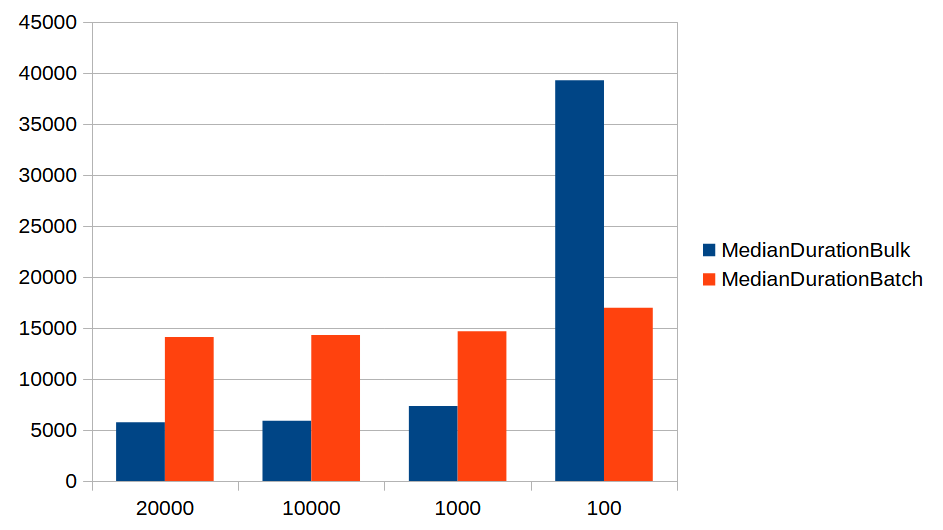

In previous discussions, we established that bulk insert and multi-value batched inserts represent the 
fastest methods for inserting data into an MS SQL Server database. 
However, before concluding this series, let's explore another option.

MS SQL Server has introduced the parameter `useBulkCopyForBatchInsert`, 
which automatically activates the bulk API for batched inserts. 
This functionality operates at the database driver level, 
enabling it to work seamlessly with both regular parameterized inserts and Hibernate inserts.

In this post, we will examine the performance impact of enabling this parameter
on Hibernate inserts and JDBC inserts. We will compare them with regular batch inserts,
manual Bulk API usage, and multi-value JDBC inserts.

The code utilized for these examples remains consistent with that used in previous posts and will not be reiterated.

I conducted tests to insert `1,000,000 Person` objects with various batch sizes (`100`, `1,000`, `10,000`, and `20,000`). 
Each test was executed 10 times, and the median time was calculated. 
With the parameter enabled, the results are as follows:

| MethodName        | MedianDuration | BatchSize |
|-------------------|----------------|-----------|
| Jdbc Template     | 5752           | 20000     |
| Jdbc Template     | 5897           | 10000     |
| Jdbc Template     | 7361.5         | 1000      |
| Hibernate Persist | 8019.5         | 10000     |
| Hibernate Persist | 8025.5         | 20000     |
| Hibernate Persist | 9491           | 1000      |
| Jdbc Template     | 39273.5        | 100       |
| Hibernate Persist | 41904          | 100       |

The JdbcTemplate insert remains faster by approximately 2 seconds for each batch size,
even with a batch size of `100`. This demonstrates that Hibernate introduces overhead in
processing entities, likely stemming from entity state tracking.
However, it's noteworthy that this overhead remains constant regardless of the batch size used.

Now, let's compare these results with regular batch inserts.
To provide clearer insights, I'll present two separate tables comparing the performance of Hibernate inserts and JDBC inserts.
Hibernate insert performance:

| Batch Size | Bulk Api Median Duration (ms) | Batched Median Duration (ms) |
|------------|-------------------------------|------------------------------|
| 10000      | 8019.5                        | 16198.5                      |
| 20000      | 8025.5                        | 16186                        |
| 1000       | 9491                          | 16825                        |
| 100        | 41904                         | 21830                        |

JDBC insert performance:

| Batch Size | Bulk Api Median Duration (ms) | Batched Median Duration (ms) |
|------------|-------------------------------|------------------------------|
| 20000      | 5752                          | 14118.5                      |
| 10000      | 5897                          | 14320                        |
| 1000       | 7361.5                        | 14683.5                      |
| 100        | 39273.5                       | 16981.5                      |

With the JDBC batching parameter enabled, we observe an average performance improvement of around 2 times.
Its behavior resembles that of the Bulk API discussed in the previous post. 
For larger batch sizes and datasets, the Bulk API outperforms, but for smaller batches, 
it exhibits poorer performance compared to regular batch inserts. 
This is logical, considering that enabling the batching parameter essentially utilizes the Bulk API in the background.

Now, how does this relate to multi-value inserts from the previous post?

The best-performing multi-value insert method had a batch size of `100` and `2,000`
bind parameters (inserting `400` persons per insert statement). It achieved inserting `1,000,000`
person objects into the database in `4.175` seconds (median duration), which is still superior to our best result
with the bulk API parameter (`5.752` seconds). Although the performance difference is not significant, the multi-insert 
method appears to be more advantageous from a performance standpoint, especially for small batches.

Furthermore, with manually implemented Bulk API inserts taking `3.188` seconds,
it's evident that manual implementation outperforms the bulk API parameter implementation. 
However, for this volume of processed data, the difference isn't substantial, as time increases linearly in both cases.

### Conclusion
We can observe that the bulk API can substantially enhance performance for bulk inserts involving large amounts of data.

It's important to highlight that even when enabling this parameter, 
the bulk API will only function if specific conditions are met. 
These conditions can be found on the following Microsoft page: 
[Using bulk copy API for batch insert operation](https://learn.microsoft.com/en-us/sql/connect/jdbc/use-bulk-copy-api-batch-insert-operation?view=sql-server-ver16)

I'd also like to mention that I encountered an issue with inserts and the bulk API parameter when the columns
of a database table are ordered differently from the entity fields. 
You can find further details about this problem at the following link: 
[Bulk Copy cannot handle inserts with subset or differently ordered columns](https://github.com/microsoft/mssql-jdbc/issues/1554). 
This issue has been resolved in the latest version of the Java MS SQL Server JDBC driver.

This parameter has limited utility; avoid enabling it blindly without first assessing the
benefits and drawbacks it may bring to your application.

For updates, you can follow me on [Twitter](https://twitter.com/mare_milenkovic) or [LinkedIn](https://www.linkedin.com/in/mare-milenkovic/).

